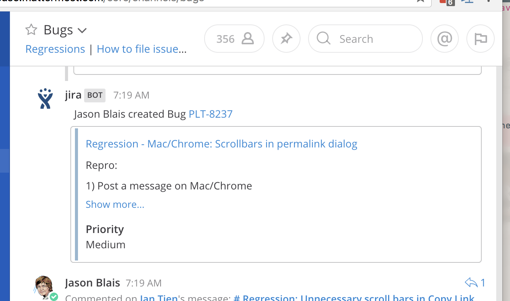

# mattermost-plugin-jira  

This plugin will create a webhook that your JIRA server can use to post messages to Mattermost when issues are created:

## Installation

Go to the GitHub releases tab and download the latest release for your server architecture. You can upload this file in the Mattermost system console to install the plugin.

## Developing

Run `make vendor` to install dependencies, then develop like any other Go project: Hack away and use `go test`, `go build`, etc.

If you want to create a fully bundled plugin that will run on a local server, you can use `make mattermost-jira-plugin.tar.gz`.

## Releasing

To make a release, update the version number in plugin.yaml, and create a release via the GitHub interface. Travis will upload the distributables for you.
