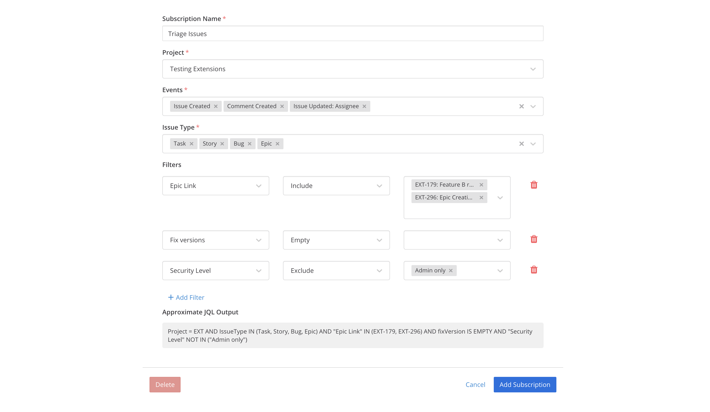

# Notification Management

## What are Notifications?

Jira notifications are messages sent to a Mattermost channel when a particular event occurs in Jira. They can be subscribed to from a channel via `/jira subscribe` \(managed within Mattermost\). A webhook can be manually set up from Jira to send a message to a particular channel in Mattermost \(managed via Jira\).

Notifications and webhooks can be used together or you can opt for one of them.


When any webhook event is received from Jira the plugin reviews all the notification subscriptions. If it matches a rule it will post a notification to the channel. If there are no subscription matches, the webhook event is discarded.

The notifications and metadata shown in a channel are not protected by Jira permissions. Anyone in the channel can see what's posted to the channel. However if they do not have the appropriate permission they won't be able to see further details of the issue if they click through to it.

## What is a notification subscription?

Mattermost users can set up rules that define when a particular event with certain criteria are met in Jira that trigger a notification is sent to a particular channel. These subscription rules can specify the `Jira Project`, `Event Type`, `Issue Type`, and can filter out issues with certain values.

When a user is setting up a notification subscription they'll only see the projects and issue types they have access to within Jira. If they can't see a project in Jira it won't be displayed as an option for that particular user when they are trying to set up a subscription in Mattermost.

An approximate JQL query is output as well. This is not guaranteed to be valid JQL and is only shown as a reference to what the query may look like if converted to JQL.

## Who can set up Notification Subscriptions for a channel?

You can specify who can set up a notification subscription in the plugin configuration. First, set which **Mattermost** user roles are allowed to access the subscription functionality:


You can also specify a comma-separated list of Jira groups the user needs to be a member of to be able to create/edit subscriptions. The user editing a subscription only needs to be a member of one of the listed groups. If this is left blank there will be no restriction on Jira groups.


A user must meet the criteria of both the Mattermost user settings and Jira group settings in order to edit subscriptions.

## How can I see all the notification subscriptions that are set up in Mattermost?

While logged in as a System Admin type `/jira subscribe list` in a Mattermost channel.

## Which notification events are supported?

The following Jira event notifications are supported:

* An issue is created
* Certain fields of an issue issue are updated, configurable per subscription
* An issue is reopened or resolved
* An issue is deleted, when not yet resolved
* Comments created, updated, or deleted

If you’d like to see support for additional events, [let us know](https://mattermost.uservoice.com/forums/306457-general).



## Setting up the webhook in Jira

In order to have Jira post events to your Mattermost instance, you'll need to set up a webhook inside of Jira. Please see the instructions at [configure webhooks on the Jira server](https://mattermost.gitbook.io/plugin-jira/setting-up/configuration#step-2-configure-webhooks-on-the-jira-server).

## Legacy Webhooks

If your organization's infrastructure is set up in such a way that your Mattermost instance can't connect to your Jira instance, you won't be able to use the Channel Subscriptions feature. Instead, you'll need to use the Legacy Webhooks feature (the first iteration of the webhooks feature supported by the Jira plugin).

1. As a Jira System Administrator, go to **Jira Settings > System > WebHooks**.
   * For older versions of Jira, select the gear icon in bottom left corner, then go to **Advanced > WebHooks**.
2. Select **Create a WebHook** to create a new webhook. Enter a **Name** for the webhook and add the Jira webhook URL [https://SITEURL/plugins/jira/webhook?secret=WEBHOOKSECRET&team=TEAMURL&channel=CHANNELURL](https://SITEURL/plugins/jira/webhook?secret=WEBHOOKSECRET&team=TEAMURL&channel=CHANNELURL) \(for Jira 2.1\) as the **URL**.

   * Replace `TEAMURL` and `CHANNELURL` with the Mattermost team URL and channel URL you want the Jira events to post to. The values should be in lower case.
   * Replace `SITEURL` with the site URL of your Mattermost instance, and `WEBHOOKSECRET` with the secret generated in Mattermost via **System Console > Plugins > Jira**.

   For instance, if the team URL is `contributors`, channel URL is `town-square`, site URL is `https://community.mattermost.com`, and the generated webhook secret is `MYSECRET`, then the final webhook URL would be:

   ```text
   https://community.mattermost.com/plugins/jira/webhook?secret=MYSECRET&team=contributors&channel=town-square
   ```
3. \(Optional\) Set a description and a custom JQL query to determine which tickets trigger events. For more information on JQL queries, refer to the [Atlassian help documentation](https://confluence.atlassian.com/jirasoftwarecloud/advanced-searching-764478330.html).
4. Finally, set which issue events send messages to Mattermost channels, then select **Save**. The following issue events are supported:
   * Issue Created
   * Issue Deleted
   * Issue Updated, including when an issue is reopened or resolved, or when the assignee is changed. Optionally send notifications for comments, see below.

By default, the legacy webhook integration publishes notifications for issue create, resolve, unresolve, reopen, and assign events. To post more events, use the following extra `&`-separated parameters:

- `updated_all=1`: all events
- `updated_comments=1`: all comment events
- `updated_attachment=1`: updated issue attachments
- `updated_description=1`: updated issue description
- `updated_labels=1`: updated issue labels
- `updated_prioity=1`: updated issue priority
- `updated_rank=1`: ranked issue higher or lower
- `updated_sprint=1`: assigned issue to a different sprint
- `updated_status=1`: transitioned issed to a different status, like Done, In Progress
- `updated_summary=1`: renamed issue

Here's an example of a webhook configured to create a post for comment events:

```text
https://community.mattermost.com/plugins/jira/webhook?secret=MYSECRET&team=contributors&channel=town-square&updated_comments=1
```
