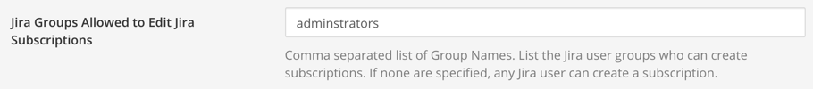

# Notification Management

## What are Notifications?

Jira notifications are messages sent to a Mattermost Channel when a particular event occurs in Jira. They can be subscribed to from a channel via `/jira subscribe` \(managed within Mattermost\) AND/OR a webhook can be manually setup from Jira to send a message to a particular channel in Mattermost \(managed via Jira\).

When any webhook event is received from Jira - the plugin reviews all the notification subscriptions and if it matches a rule - it will post a notification to the channel. If there are no subscription matches, the webhook event is discarded.

The notifications and metadata shown in a channel are not protected by Jira permissions. Anyone in the channel can see what is posted to the channel - if they click on the issue link, Jira will not let the user see further details if they do not have the appropriate permission.

## What is a Notification Subscription?

Mattermost users can setup rules that define when a particular event with certain criteria are met in Jira - that a notification is sent to a particular channel. These subscription rules can specify the Jira Project, Event Type, Issue Type and can filter out issues with certain values.

When a user is setting up a notification subscription - they will only see the projects and issue types they have access to within Jira. If they cannot see a project in Jira - it will not be displayed as an option for that particular user when they are trying to setup a subscription in Mattermost.

An approximate JQL query is output as well, it may need some 'massaging' to work properly in Jira if you are using custom fields or values with spaces in them \(you will need to add " 's around the values\).

SCREENSHOT

## Who can setup Notification Subscriptions for a channel?

You can define in the plugin configuration who can setup a notification subscription.

First, set which **Mattermost** user roles are allowed to access the subscription functionality at all:

Then, you can specify which Jira groups they ALSO need to be a member of, in order to access the subscription editor:

## How can I see all the notification subscriptions that are setup in Mattermost?

While logged in as a system administrator, in a Mattermost channel type in `/jira list`

## How can I setup Mattermost notifications directly within Jira?

Notifications are configured with webhooks and offer full JQL support.

## Which notification events are supported?

The following Jira event notifications are supported:

* Issue created
* Issue updated, including when an issue is reopened or resolved, or when the assignee is changed
* Issue deleted when not yet resolved
* Comments created, updated or deleted

If you’d like to see support for additional events, [let us know](https://mattermost.uservoice.com/forums/306457-general).

