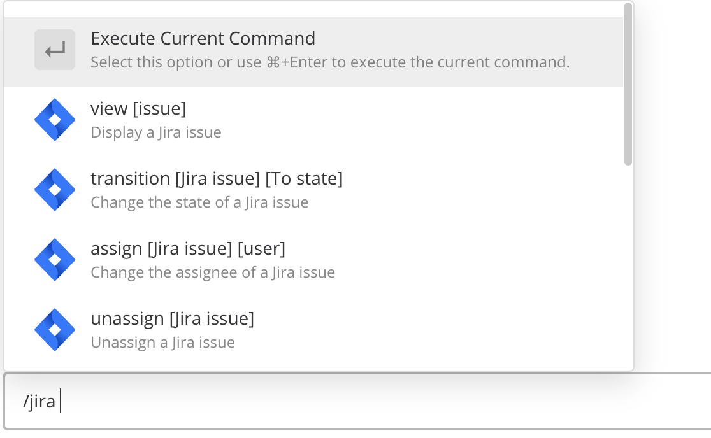

# Getting Started

To get started with the Jira/Mattermost connector is easy.  You'll first need to connect your Jira account with your Mattermost account so the system can perform actions such as searching, viewing and creating Jira issues on your behalf.

1. Go into any channel within Mattermost, and type `/jira connect`.
2. Follow the link that gets presented to you - it will bring you to your Jira server.
3. Select **Allow**.

You may notice that when you type `/` a menu pops up - these are called **slash commands** and bring the functionality of Jira \(and other integrations\) to your fingertips.

## Authentication issues with Jira Cloud

If connecting to a Jira cloud instance, you will need to temporarily enable third-party cookies in your browser during the Jira authentication process.
If you are using Google Chrome, this can be done by going to the browser's cookie settings and selecting "Allow all cookies". You can paste `chrome://settings/cookies` into your address bar to access these settings. After your Jira account is connected, feel free to disable the third-party cookies setting in your browser.
