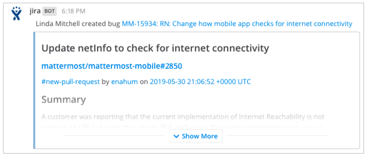

# Managing Jira issues from Mattermost

### Create Jira issues

To create a Jira issue from a Mattermost message, hover over the relevant message and select **\(...\) > More Actions > Create Jira Issue**.

Then select the project and issue type, add a summary, and fill out any other fields for the issue.

Click **Create** to create the issue which includes any file attachments that were part of the Mattermost message.

**Note:** This plugin does not support all Jira fields. If the project you tried to create an issue for has **required fields** not yet supported, you'll be prompted to manually create an issue. Clicking the provided link opens the issue creation screen on the Jira web interface. The information you entered in Mattermost is migrated over so no work is lost.

The supported Jira fields are:

* **Project Picker:** Custom fields and the built-in **Project** field.
* **Single-Line Text:** Custom fields, and built-in fields such as **Summary** and **Environment**.
* **Multi-Line Text:** Custom fields, and built-in fields such as **Description**.
* **Single-Choice Select:** Custom fields, and built-in fields such as **Issue Type** and **Priority**.

### Attach Messages to Jira issues

Keep all information in one place by attaching parts of Mattermost conversations in Jira issues as comments. To attach a message, hover over the relevant message and select **\(...\) > More Actions > Attach to Jira Issue**.

Then, on the resulting dialog, select the issue you want to attach it to. You may search for issues containing specific text or just the issue number.

Click **Attach** and the message is attached to the selected Jira issue as a comment with a permalink to the conversation thread as well so you can maintain context of the comment.
