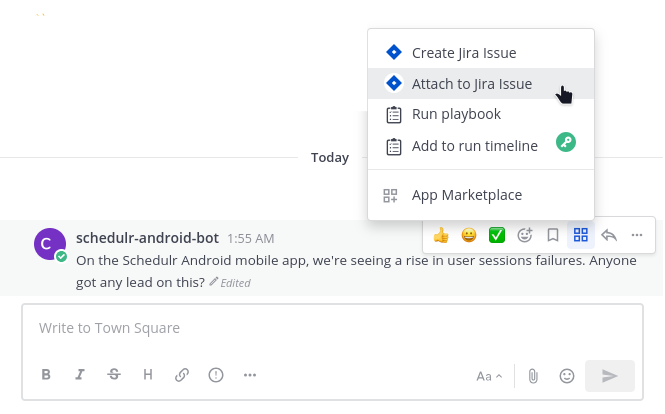

# Mattermost Jira Plugin

[](https://circleci.com/gh/mattermost/mattermost-plugin-jira)
[](https://codecov.io/gh/mattermost/mattermost-plugin-jira)
[](https://github.com/mattermost/mattermost-plugin-jira/releases/latest)
[](https://github.com/mattermost/mattermost-plugin-jira/issues?q=is%3Aissue+is%3Aopen+sort%3Aupdated-desc+label%3A%22Up+For+Grabs%22+label%3A%22Help+Wanted%22)

This plugin supports a two-way integration between Mattermost and Jira. Jira Core and Jira Software products, for Server, Data Center, and Cloud platforms are supported. It has been tested with versions 7 and 8.

For versions v3.0 and later of this plugin, support for multiple Jira instances is offered for Mattermost Professional, Enterprise and Enterprise Advanced plans, configured using [Administrator Slash Commands](https://github.com/mattermost/mattermost-plugin-jira#readme).

See the [Mattermost Product Documentation](https://docs.mattermost.com/integrate/jira-interoperability.html) for details on installing, configuring, enabling, and using this Mattermost integration.

## Feature summary

### Jira to Mattermost notifications

#### Channel subscriptions

Notify your team of the latest updates by sending notifications from your Jira projects to Mattermost channels. You can specify which events trigger a notification - and you can filter out certain types of notifications to keep down the noise.

#### Personal notifications: JiraBot

Each user in Mattermost is connected with their own personal Jira account and notifications for issues where someone is mentioned or assigned an issue is mentioned in your own personal Jira notification bot to help everyone stay on top of their assigned issues.


### Manage Jira issues in Mattermost

#### Create Jira issues

- Create Jira issues from scratch or based off of a Mattermost message easily.
- Without leaving Mattermost's UI, quickly select the project, issue type and enter other fields to create the issue.

  

#### Attach messages to Jira issues

Keep all information in one place by attaching parts of Mattermost conversations in Jira issues as comments.  Then, on the resulting dialog, select the Jira issue you want to attach it to. You may search for issues containing specific text.




#### Transition Jira issues

Transition issues without the need to switch to your Jira project. To transition an issue, use the `/jira transition <issue-key> <state>` command.

For instance, `/jira transition EXT-20 done` transitions the issue key **EXT-20** to **Done**.


#### Assign Jira issues

Assign issues to other Jira users without the need to switch to your Jira project. To assign an issue, use the `/jira assign` command.

For instance, `/jira assign EXT-20 john` transitions the issue key **EXT-20** to **John**.

## License

This repository is licensed under the Apache 2.0 License, except for the [server/enterprise](server/enterprise) directory which is licensed under the [Mattermost Source Available License](LICENSE.enterprise). See [Mattermost Source Available License](https://docs.mattermost.com/overview/faq.html#mattermost-source-available-license) to learn more.

## Development

This plugin contains both a server and web app portion. Read our documentation about the [Developer Workflow](https://developers.mattermost.com/integrate/plugins/developer-workflow/) and [Developer Setup](https://developers.mattermost.com/integrate/plugins/developer-setup/) for more information about developing and extending plugins.

### Releasing new versions

The version of a plugin is determined at compile time, automatically populating a `version` field in the [plugin manifest](plugin.json):
* If the current commit matches a tag, the version will match after stripping any leading `v`, e.g. `1.3.1`.
* Otherwise, the version will combine the nearest tag with `git rev-parse --short HEAD`, e.g. `1.3.1+d06e53e1`.
* If there is no version tag, an empty version will be combined with the short hash, e.g. `0.0.0+76081421`.

To disable this behaviour, manually populate and maintain the `version` field.

## How to Release

To trigger a release, follow these steps:

1. **For Patch Release:** Run the following command:
    ```
    make patch
    ```
   This will release a patch change.

2. **For Minor Release:** Run the following command:
    ```
    make minor
    ```
   This will release a minor change.

3. **For Major Release:** Run the following command:
    ```
    make major
    ```
   This will release a major change.

4. **For Patch Release Candidate (RC):** Run the following command:
    ```
    make patch-rc
    ```
   This will release a patch release candidate.

5. **For Minor Release Candidate (RC):** Run the following command:
    ```
    make minor-rc
    ```
   This will release a minor release candidate.

6. **For Major Release Candidate (RC):** Run the following command:
    ```
    make major-rc
    ```
   This will release a major release candidate.

### Environment

Join the [Jira plugin channel](https://community.mattermost.com/core/channels/jira-plugin) on our community server to discuss any questions.

Read our documentation about the [Developer Workflow](https://developers.mattermost.com/extend/plugins/developer-workflow/) and [Developer Setup](https://developers.mattermost.com/extend/plugins/developer-setup/) for more information about developing and extending plugins.

This plugin supports both Jira Server (self-hosted) and Jira Cloud instances. There can be slight differences in behavior between the two systems, so it's best to test with both systems individually when introducing new webhook logic, or adding a new Jira API call.

To test your changes against a local instance of Jira Server, you need [Docker](https://docs.docker.com/install) installed, then you can use the `docker-compose.yml` file in this repository to create a Jira instance. Simply run `docker-compose up` in the directory of the repository, and a new Jira server should start up and be available at http://localhost:8080. It can take a few minutes to start up due to Jira Server's startup processes. If the container fails to start with `exit code 137`, you may need to increase the amount of RAM you are allowing docker to use.

To test your changes against a Jira Cloud instance, we recommend starting a 14-day trial, if you don't have a Jira project to test against. More information can be found here: https://www.atlassian.com/software/jira/try.

### Help wanted!

If you're interested in joining our community of developers who contribute to Mattermost - check out the current set of issues [that are being requested](https://github.com/mattermost/mattermost-plugin-jira/issues?q=is%3Aissue+is%3Aopen+label%3AEnhancement).

You can also find issues labeled ["Help Wanted"](https://github.com/mattermost/mattermost-plugin-jira/issues?q=is%3Aissue+is%3Aopen+label%3A%22Help+Wanted%22) in the Jira Repository that we have laid out the primary requirements for and could use some coding help from the community.

### Help and support

- For Mattermost customers - Please open a support case.
- For questions, suggestions, and help, visit the [Jira Plugin channel](https://community.mattermost.com/core/channels/jira-plugin) on our Community server.
- To report a bug, please [open an issue](https://github.com/mattermost/mattermost-plugin-jira/issues).
